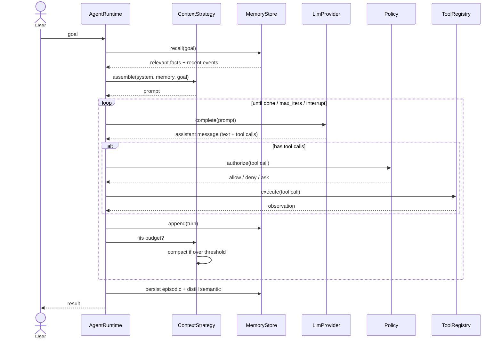
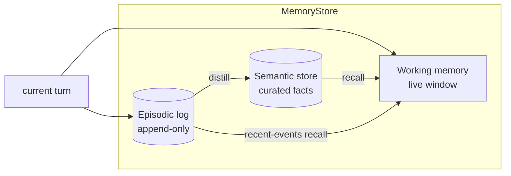
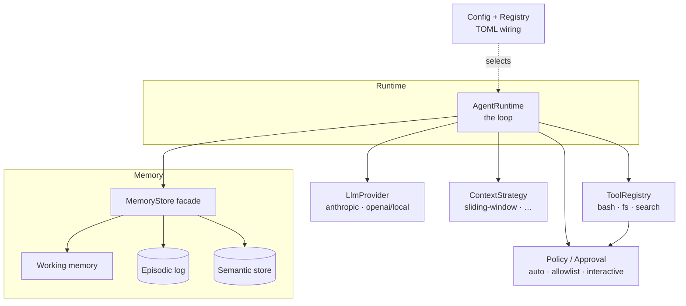

# agent-seddon — Design

> An experimental, modular coding-agent harness in Rust. Every major component —
> the LLM provider, the tools, the memory, the context assembly — sits behind a
> trait so that alternative implementations can be swapped by config and compared
> cheaply. This document fixes the vocabulary, the loop, the memory model, the
> pluggable seams, and situates the design against comparable open-source agents.

---

## 1. Overview & goals

`agent-seddon` is a *harness*, not a single agent. Its purpose is **experimentation**:
we want to try different memory strategies, different context-compaction schemes,
different providers, and different tool sets, and to compare them without rewriting
the loop each time.

Design principles:

- **Seams are traits.** Each replaceable component is an `async` trait object. The
  loop depends only on the trait, never on a concrete implementation.
- **Wiring is config.** Which implementation is used for each seam is chosen in a
  TOML file (and gated at compile time by cargo features). Changing the memory
  backend or the provider is a one-line config edit, not a code change.
- **Layered memory is first-class.** Memory is not "the message list" — it is three
  distinct, individually swappable layers (working / episodic / semantic).
- **Small, honest prototype.** The first milestone runs one real end-to-end loop.
  Everything else is a documented seam we can fill in later.

Non-goals for the prototype: multi-user serving, a GUI, sandboxed tool execution
hardening, and distributed subagents. These are noted where the design leaves room
for them, but they are out of scope for v1.

---

## 2. The agent loop

The core is a straightforward agentic loop: assemble context → ask the model → run
any tools it asked for → record what happened → repeat until done. The novelty is
*not* the loop shape; it is that every step delegates to a swappable trait.

Steps:

1. **Ingest goal.** The user's goal enters the runtime. The `ContextStrategy`
   assembles the initial context: system prompt + memory recall (relevant semantic
   facts + recent episodic events) + the goal.
2. **Model call.** The `LlmProvider` is invoked with the assembled request and
   returns an assistant message that may contain text and/or tool calls.
3. **Tool dispatch.** If the message contains tool calls, each is routed through the
   `Policy` (approval / permission gate) and then executed by the `ToolRegistry`.
   Observations (stdout, file contents, errors) are collected.
4. **Record.** The turn (assistant message + tool observations) is appended to
   working memory and the episodic log.
5. **Context management.** The `ContextStrategy` checks the token budget. If over
   threshold it compacts — summarizing older turns non-destructively (the raw
   episodic log is never mutated; only the working window is condensed).
6. **Termination check.** Finish if the model signalled completion, `max_iterations`
   was hit, or the user interrupted; otherwise loop back to step 2.
7. **Finish.** Persist the episodic log and, optionally, run the **distillation
   pipeline** to promote durable facts from this session into semantic memory.



---

## 3. Memory model (centerpiece)

Memory is the part we most want to experiment with, so it is deliberately layered.
A single `MemoryStore` facade fronts three independently swappable layers, each with
its own trait. An agent can mix, e.g., an in-memory working buffer with a
vector-backed semantic store.

| Layer | Question it answers | Lifetime | Default impl |
|-------|--------------------|----------|--------------|
| **Working** | "What are we doing right now?" | Current task | In-memory message window |
| **Episodic** | "What happened?" | Across sessions, append-only | JSONL log on disk |
| **Semantic** | "What is true / known?" | Long-lived, curated | Markdown files w/ frontmatter |
| *Procedural (future)* | "What skills have we learned?" | Long-lived | — (noted, not built) |

- **Working memory** is the live window handed to the model each turn. It is
  volatile and subject to compaction. It is *derived* from the other layers plus the
  current turn — not the source of truth.
- **Episodic memory** is an append-only event log ("model said X", "ran tool Y →
  Z"). It is never mutated, which makes runs replayable and makes compaction safe:
  we can always reconstruct. Default is JSONL on disk.
- **Semantic memory** is curated, durable knowledge — the equivalent of
  Claude Code's memory files: markdown with YAML frontmatter (`name`, `description`,
  `type`), one fact per file, plus an index loaded each session. It is git-friendly
  and human-inspectable. Documented alternates behind the same trait: **SQLite**
  (structured queries) and a **vector store** (Qdrant / LanceDB) for embedding recall.

Two pipelines connect the layers:

- **Recall** (before/within a turn): `query → retrieve → inject`. The default
  retriever is keyword/recency-based (cheap, no embedding infra). An optional
  embedding retriever ranks semantic entries by vector similarity. Retrieved items
  are injected into the working context by the `ContextStrategy`.
- **Distillation** (on session end, or on demand): scan the episodic log for durable
  facts and promote them into semantic memory (dedup against existing entries). This
  is the harness analogue of Hermes' "agent-curated memory" learning loop.



---

## 4. Pluggable seams (traits)

All seams are `async` and object-safe (`dyn`), so the runtime holds them as
`Arc<dyn Trait>` and the concrete type is chosen at wiring time. Signatures below are
illustrative sketches (error types elided as `Result<T>`).

### 4.1 `LlmProvider`

Wraps a model behind a uniform request/response. This mirrors Hermes'
`ProviderTransport` abstraction (message conversion + transport per provider) and
OpenCode's Models.dev capability metadata (so the loop can ask "does this model
support tool calls / images?" without hardcoding).

```rust
#[async_trait]
pub trait LlmProvider: Send + Sync {
    /// Model + provider capabilities (tool calling, streaming, context window…).
    fn capabilities(&self) -> ModelCapabilities;

    /// Non-streaming completion.
    async fn complete(&self, req: CompletionRequest) -> Result<CompletionResponse>;

    /// Streaming completion (default: adapt `complete` into a one-item stream).
    async fn stream(&self, req: CompletionRequest)
        -> Result<BoxStream<'static, Result<CompletionChunk>>>;
}
```

`CompletionRequest` carries messages, the tool schemas, and sampling params.
`CompletionResponse` carries assistant text and a normalized `Vec<ToolCall>` — each
provider impl is responsible for parsing its own tool-call format (native JSON,
XML-tagged Hermes-style, etc.) into that common shape.

Impls (both shipped): `OpenAiCompatProvider` (also covers local OpenAI-compatible
servers like Ollama) and `AnthropicProvider` (native Messages API). Both implement
real incremental **streaming** — `stream` is an additive, defaulted trait method,
so a provider that only implements `complete` still streams (via a single terminal
chunk). See §9 for the "wrap `genai`" option for more providers.

### 4.2 `Tool` and `ToolRegistry`

```rust
#[async_trait]
pub trait Tool: Send + Sync {
    fn name(&self) -> &str;
    /// JSON Schema describing the arguments (serde-derived where possible).
    fn schema(&self) -> ToolSchema;
    async fn execute(&self, args: serde_json::Value, ctx: &ToolContext)
        -> Result<Observation>;
}

pub trait ToolRegistry: Send + Sync {
    fn describe_all(&self) -> Vec<ToolSchema>;      // advertised to the model
    fn get(&self, name: &str) -> Option<Arc<dyn Tool>>;
}
```

Built-in tools: `bash`, `read_file`, `write_file` (`tool-core`), `edit`
(`tool-edit`), and `grep` / `find` / `ls` (`tool-search`, gitignore-aware). Custom
tools register into the same registry, so an experiment can add or replace tools
without touching the loop. `Tool::parallel_safe` (default `true`) lets a tool opt
out of concurrent execution within a turn.

### 4.3 `MemoryStore` (+ layer traits)

```rust
#[async_trait]
pub trait MemoryStore: Send + Sync {
    async fn recall(&self, query: &RecallQuery) -> Result<Vec<MemoryItem>>;
    async fn append(&self, event: MemoryEvent) -> Result<()>;
    async fn distill(&self) -> Result<usize>;       // episodic → semantic
}

#[async_trait] pub trait EpisodicStore: Send + Sync { /* append / range / replay */ }
#[async_trait] pub trait SemanticStore: Send + Sync { /* upsert / retrieve / index */ }
```

The default `MemoryStore` composes an in-memory working buffer, a JSONL
`EpisodicStore`, and a markdown `SemanticStore`. Swapping the semantic layer to
SQLite or a vector DB is a config change.

### 4.4 `ContextStrategy` / `Compactor`

```rust
#[async_trait]
pub trait ContextStrategy: Send + Sync {
    /// Build the model-ready message list from goal + recalled memory + working set.
    async fn assemble(&self, input: ContextInput) -> Result<Vec<Message>>;
    /// Compact when over budget; non-destructive w.r.t. the episodic log.
    async fn compact(&self, working: &mut WorkingSet, budget: TokenBudget) -> Result<()>;
}
```

Two strategies ship: `SlidingWindow` (drops the oldest turns — lossy but free) and
`SummarizingWindow` (`context-summarizing`), which keeps the head + a recent tail
(`keep_recent_tokens`) and replaces the middle with a single LLM-generated summary,
falling back to truncation if the summarizer errors. Because summarization needs a
model, the registry passes the already-built provider to every context factory
(most ignore it). Further strategies (map-reduce, retrieval-only) plug in here.

### 4.5 Supporting seams: `Policy` and `Agent`

- **`Policy` / `Approval`** — the permission gate for tool calls: `allow`, `deny`, or
  `ask` (human-in-the-loop). Impls: `AutoApprove`, `AllowList`, `Interactive`.
- **`Agent` (mode/persona)** — a named configuration bundle (system prompt + tool
  subset + policy), à la Roo Code modes. This is also the seam for **delegated
  subtasks**: a parent agent can spawn a child agent with an *isolated* context and
  receive only a summary back (Roo Code's "boomerang" pattern), preventing context
  pollution. **Implemented** as the `delegate` tool (`agent-runtime/src/subagent.rs`,
  feature `subagents`): the child reuses the same provider/tools/context/policy,
  runs its own loop, and returns only its final summary; recursion is bounded by
  `subagent_max_depth`.

### 4.6 External tools: MCP

Tools need not be in-tree. The `agent-mcp` crate is a **Model Context Protocol**
client (feature `mcp`): it connects to configured servers over **stdio**
(subprocess) or **streamable HTTP**, discovers their tools (`tools/list`), and
registers each as an `mcp_<server>_<tool>` `Tool` in the same `ToolRegistry` as the
built-ins. This is the harness's answer to "add capabilities without writing Rust"
— point it at any MCP server. Connection is best-effort; a failing server is logged
and skipped.

### 4.7 Skills

The other no-Rust extension path: a **skill** is a `SKILL.md` file (frontmatter +
markdown body) under `skills/` or `.agent/skills/`. The REPL's `/skills` lists them
and `/skill:<name>` loads one skill's body into the conversation on demand
(progressive disclosure — the descriptions are cheap to browse; only the chosen
skill's body enters context). Discovery/loading lives in `agent-runtime::skills`;
injection is `Session::add_context`.

---

## 5. Modularity mechanism — how swapping actually works

Three cooperating mechanisms:

1. **Traits in the core crate.** `agent-core` defines every seam trait and the shared
   types. Nothing else is depended on by the loop.
2. **Compile-time gating with cargo features.** Each implementation lives behind a
   feature (`provider-anthropic`, `provider-openai`, `memory-vector`, …). Builds pull
   in only what an experiment needs.
3. **Runtime selection via a registry/factory.** A `Registry`
   (`agent-runtime/src/registry.rs`) maps config strings to factories, one map per
   seam. The runtime reads the config, asks the registry for each seam by name, and
   wires the loop. Built-ins are registered in one feature-gated `register_builtins`;
   `build_agent_with(&Registry, …)` is public, so out-of-tree crates can register
   their own factories without forking. See [`docs/extending.md`](docs/extending.md).

Config is the experimentation lever — a single TOML file:

```toml
[agent]
provider = "anthropic"        # -> AnthropicProvider  ("openai-compat" -> OpenAiCompatProvider)
context  = "sliding-window"   # -> SlidingWindow
policy   = "interactive"
stream         = true         # incremental SSE + live echo (false = buffered)
parallel_tools = true         # run a turn's parallel-safe tool calls concurrently

[memory]
backend = "file"              # -> FileMemory  (future: "sqlite", "vector")

[tools]
enabled = ["bash", "read_file", "write_file", "edit", "grep", "find", "ls"]
```

Swapping `provider = "openai-compat"` or `backend = "vector"` changes behavior with
no code edit — exactly the property we want for A/B comparison. Each impl also sits
behind a **cargo feature** (`provider-*`, `tool-*`, `context-*`, `memory-*`), so a
`--no-default-features` build links only what it needs. *Future:* dynamic,
out-of-process plugins via `libloading` (the registry API is left clean for it).

---

## 6. System component diagram



Each box that the runtime points to is a trait in §4 and a crate in §7 — the diagram,
the trait sketches, and the workspace layout are intentionally one-to-one.

---

## 7. Proposed workspace layout

A Cargo workspace with one crate per seam, so implementations can be added or swapped
in isolation and features can gate them independently.

```
agent-seddon/
├── Cargo.toml                # workspace
├── crates/
│   ├── agent-core/           # seam traits + shared types (no impls)
│   ├── agent-providers/      # LlmProvider impls: anthropic, openai/local
│   ├── agent-tools/          # Tool impls: bash, read_file, write_file, search
│   ├── agent-memory/         # MemoryStore + working/episodic/semantic impls
│   ├── agent-context/        # ContextStrategy impls: sliding-window, …
│   ├── agent-runtime/        # the loop + Registry wiring + Policy
│   └── agent-cli/            # binary: parse config, build runtime, run goal
└── config/agent.toml         # example wiring
```

Dependency direction: everything depends on `agent-core`; `agent-runtime` depends on
the impl crates (feature-gated); `agent-cli` depends on `agent-runtime`. `agent-core`
depends on nothing internal.

---

## 8. Comparison with prior art

We deliberately borrow proven ideas. The table maps each comparable agent to the seam
in our design it most informs.

| Aspect | **agent-seddon** (this) | **Hermes** (Nous Research) | **OpenCode** (SST) | **Roo Code** (RooCodeInc) |
|---|---|---|---|---|
| Language | Rust | Python (+TS) | TypeScript (+Go TUI) | TypeScript (VS Code ext) |
| Core loop | Trait-driven loop, config-wired | Single `AIAgent` core across many frontends | Client/server; `SessionPrompt.loop` over HTTP+SSE | Mode-dispatched loop in the editor |
| Tool system | `Tool`/`ToolRegistry`, serde schemas; normalized `ToolCall` | 40+ tools; multi-terminal backends | `Tool.define()` + registry; custom/plugin tools | 20+ tools; native + XML protocols; MCP |
| Memory / context | 3-layer memory (working/episodic/semantic) + swappable `ContextStrategy` | Agent-curated memory; closed learning loop | Session store; compaction at ~95% of window | Intelligent condensing; non-destructive truncation |
| Provider abstraction | `LlmProvider` trait; ≥2 impls; capability metadata | `ProviderTransport` ABC (Anthropic/OpenAI/Bedrock/…) | Models.dev metadata + Vercel AI SDK (75+) | Anthropic msg format internally; multi-provider |
| Extensibility | Cargo features + config registry; future `libloading` | Transports + tools + skills | JS/TS plugin hooks + custom tools | Custom **modes**; MCP servers |

Direct borrowings, made explicit:

- **From Hermes** — the `ProviderTransport` abstraction is essentially our
  `LlmProvider` seam (each transport owns message + tool-call conversion); and the
  "agent-curated memory / closed learning loop" is our **distillation** pipeline
  (episodic → semantic).
- **From OpenCode** — threshold-triggered, non-destructive context **compaction**,
  and treating provider **capabilities as metadata** the loop can query.
- **From Roo Code** — **modes/personas** (our `Agent` bundles) and **boomerang
  subtasks** with isolated context returning summary-only (our delegated-subtask
  pattern).

> **"Hermes" disambiguation.** There are two Nous Research artifacts named Hermes: the
> **Hermes agent** (a full agent harness — the relevant comparison here) and the
> **Hermes function-calling format** (a ChatML/XML `<tool_call>` convention used by
> the Hermes *models*). We compare against the agent; the format is just one concrete
> tool-call encoding a provider impl could parse.

---

## 9. Dependency choices

Baseline crates: **`tokio`** (async runtime), **`serde` / `serde_json`**
(schemas, config, messages), **`thiserror`** in library crates + **`anyhow`** in the
binary, **`tracing`** for structured logging of the loop (invaluable for comparing
runs), **`reqwest`** for HTTP, **`toml`** for config.

**Key decision to record — provider layer:** hand-roll provider clients
(`reqwest` + e.g. `async-anthropic`) *versus* wrap an existing multi-provider crate
(**`genai`**, ~26 providers; or **`rig-core`**, a fuller agent framework) behind our
own `LlmProvider` trait.

- **Recommendation:** wrap **`genai`** behind `LlmProvider` for the prototype. It buys
  many providers immediately (including local/Ollama), and because our own trait stays
  the stable seam, we can drop to a hand-rolled client later for any provider that
  needs behavior `genai` doesn't expose — without touching the loop. We keep
  `rig-core` in mind as a reference for the tool-macro and vector-store patterns, but
  we do **not** adopt it as the framework, because the whole point is that *we* own the
  seams.

Embeddings/vector recall (optional): **Qdrant** (native Rust) or **LanceDB**
(embedded) behind the `SemanticStore` trait — feature-gated, off by default.

---

## 10. First build increment & open questions

**Build increment (the "full modular scaffold" milestone).** Stand up the workspace
in §7 with one thin impl per seam and run the loop end-to-end:

- `agent-core`: all seam traits + shared types.
- `agent-providers`: one working `LlmProvider` (Anthropic direct, or the `genai`
  wrapper).
- `agent-tools`: `bash` + `read_file` + `write_file`.
- `agent-memory`: in-memory working, JSONL episodic, markdown semantic.
- `agent-context`: sliding-window strategy.
- `agent-runtime` + `agent-cli`: registry wiring, run a goal from the CLI.

Success = `cargo run -p agent-cli -- "list files in this repo"` completes one full
loop iteration (model call → tool exec → observation → response), and flipping
`provider`/`memory` in the TOML changes behavior with no code edit.

**Open questions — status:**

1. ~~Streaming vs. buffered completions first?~~ **Resolved:** both. `stream` is an
   additive, defaulted trait method; the loop consumes a chunk stream, and each
   provider ships real SSE. `stream = false` selects the buffered path.
2. Embedding-based recall in v1, or keyword/recency only? (Still keyword-first.)
3. ~~Tool execution: fully async, or blocking-in-spawn for `bash`?~~ **Resolved:**
   async; a turn's parallel-safe tool calls run concurrently (`parallel_tools`),
   and blocking walkers (`grep`/`find`/`ls`) run on `spawn_blocking`.
4. Where does the distillation pipeline run — end-of-session only, or also on demand?
   (Still a no-op stub; unchanged.)
5. ~~How much of the `Agent`/subtask delegation to build vs. stub as a seam?~~
   **Resolved:** built as the `delegate` tool (§4.5), depth-bounded. MCP client
   (§4.6) added alongside for external tools.
