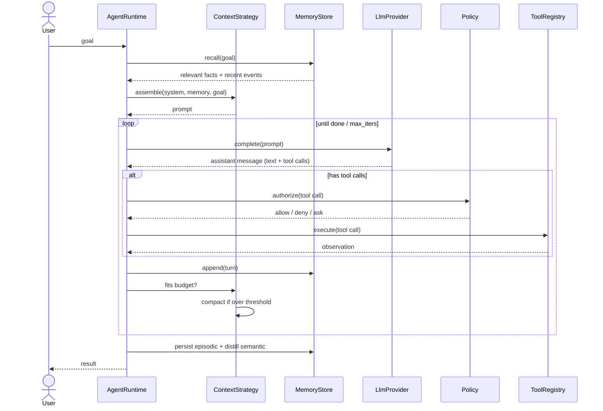
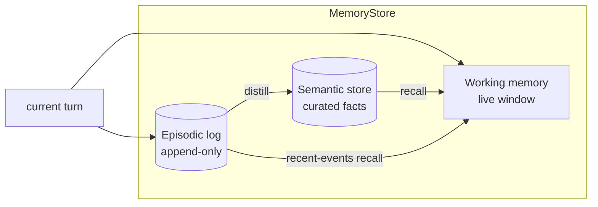
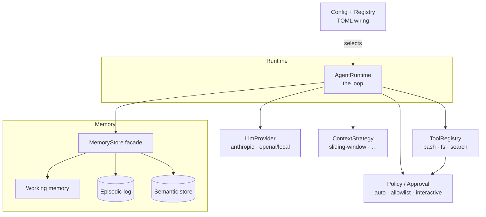

# agent-seddon — Design

> An experimental, modular coding-agent harness in Rust. Every major component —
> the LLM provider, the tools, the memory, the context assembly — sits behind a
> trait so that alternative implementations can be swapped by config and compared
> cheaply. This document fixes the vocabulary, the loop, the memory model, the
> pluggable seams, and situates the design against comparable open-source agents.

---

## 1. Overview & goals

`agent-seddon` is a *harness*, not a single agent. Its purpose is **experimentation**:
we want to try different memory strategies, different context-compaction schemes,
different providers, and different tool sets, and to compare them without rewriting
the loop each time.

Design principles:

- **Seams are traits.** Each replaceable component is an `async` trait object. The
  loop depends only on the trait, never on a concrete implementation.
- **Wiring is config.** Which implementation is used for each seam is chosen in a
  TOML file (and gated at compile time by cargo features). Changing the memory
  backend or the provider is a one-line config edit, not a code change.
- **Layered memory is first-class.** Memory is not "the message list" — it is three
  distinct layers (working / episodic / semantic), each behind a trait. The whole
  `MemoryStore` backend is registry-swappable, and the episodic and semantic layers
  are independently swappable too (`[memory] semantic` selects a `SemanticStore`
  composed against the file episodic log via `LayeredMemory`) — see §3.
- **Small, honest prototype.** The first milestone runs one real end-to-end loop.
  Everything else is a documented seam we can fill in later.

Non-goals for the prototype: multi-user serving, a GUI, sandboxed tool execution
hardening, and distributed subagents. These are noted where the design leaves room
for them, but they are out of scope for v1.

---

## 2. The agent loop

The core is a straightforward agentic loop: assemble context → ask the model → run
any tools it asked for → record what happened → repeat until done. The novelty is
*not* the loop shape; it is that every step delegates to a swappable trait.

Steps:

1. **Ingest goal.** The user's goal enters the runtime. On a session's *first*
   turn the `ContextStrategy` assembles the initial context: system prompt +
   memory recall (relevant semantic facts) + the goal. In the multi-turn REPL,
   later turns append the new user message to the running working set instead of
   re-assembling (`Session::send` in `crates/agent-runtime/src/agent.rs`).
2. **Model call.** The `LlmProvider` is invoked with the assembled request and
   returns an assistant message that may contain text and/or tool calls. The loop
   consumes it as a stream (with a live echo) when `stream = true`.
3. **Tool dispatch.** If the message contains tool calls, each is routed through the
   `Policy` (approval / permission gate) and then executed by the `ToolRegistry` —
   concurrently when `parallel_tools = true` and every tool is parallel-safe,
   results appended in call order. Observations (stdout, file contents, errors) are
   collected.
4. **Record.** The turn (assistant message + tool observations) is appended to
   working memory and the episodic log.
5. **Context management.** The `ContextStrategy` checks the token budget. If over
   threshold it compacts — either dropping the oldest turns (`SlidingWindow`) or
   LLM-summarizing them (`SummarizingWindow`), see §4.4. Compaction is
   non-destructive: the raw episodic log is never mutated; only the working window
   is condensed.
6. **Termination check.** Finish if the model returned no tool calls (final
   answer), `max_iterations` was hit, or an error occurred; otherwise loop back to
   step 2. (There is no in-loop user-interrupt path; the REPL exits on stdin EOF,
   outside the loop.)
7. **Finish.** The episodic log is already persisted incrementally. The
   **distillation pipeline** (promote durable facts into semantic memory) is
   invoked at session end; it is model-backed and **opt-in** via `[memory] distill`
   (off by default, so no extra model call unless enabled) — see §3.



---

## 3. Memory model (centerpiece)

Memory is the part we most want to experiment with, so it is deliberately layered.
A single `MemoryStore` facade fronts three layers. The `EpisodicStore` and
`SemanticStore` layer traits are defined in `agent-core`, and `LayeredMemory`
composes one of each into the facade. The registry can select the whole
`MemoryStore` backend by `[memory] backend`, **or** swap just the semantic layer by
`[memory] semantic` (composed against the file episodic log) — so a SQLite/vector
semantic store plugs in without reimplementing the episodic log or the loop.

| Layer | Question it answers | Lifetime | Default impl |
|-------|--------------------|----------|--------------|
| **Working** | "What are we doing right now?" | Current task | In-memory message window |
| **Episodic** | "What happened?" | Across sessions, append-only | JSONL log on disk |
| **Semantic** | "What is true / known?" | Long-lived, curated | Markdown files w/ frontmatter |
| *Procedural (future)* | "What skills have we learned?" | Long-lived | — (noted, not built) |

- **Working memory** is the live window handed to the model each turn. It is
  volatile and subject to compaction. It is *derived* from the other layers plus the
  current turn — not the source of truth.
- **Episodic memory** is an append-only event log ("model said X", "ran tool Y →
  Z"). It is never mutated, which makes runs replayable and makes compaction safe:
  we can always reconstruct. Default is JSONL on disk.
- **Semantic memory** is curated, durable knowledge — the equivalent of
  Claude Code's memory files: markdown with YAML frontmatter (`name`, `description`,
  `type`), one fact per file. It is git-friendly and human-inspectable. Documented
  future alternates behind the same trait: **SQLite** (structured queries) and a
  **vector store** (Qdrant / LanceDB) for embedding recall — neither built yet.

Two pipelines connect the layers:

- **Recall** (on a session's first turn): `query → retrieve → inject`. The shipped
  retriever is **keyword-based** — a live scan of the semantic directory scored by
  keyword-match count (no pre-built index, no recency weighting, no embeddings;
  `crates/agent-memory/src/file.rs`). An embedding retriever is a future option.
  Retrieved items are injected into the working context by the `ContextStrategy`.
- **Distillation** (episodic → semantic promotion): the agent-curated learning
  loop. `FileSemantic::distill()` reads a window of recent episodic events, asks the
  model to extract durable facts, and writes them as a curated markdown file (which
  recall then surfaces). It runs at session end and is **opt-in** via
  `[memory] distill = true`; with the flag off (the default) no provider is attached
  and it is a no-op returning 0, so the default build makes no extra model calls.



---

## 4. Pluggable seams (traits)

All seams are `async` and object-safe (`dyn`), so the runtime holds them as
`Arc<dyn Trait>` and the concrete type is chosen at wiring time. Signatures below are
illustrative sketches (error types elided as `Result<T>`).

### 4.1 `LlmProvider`

Wraps a model behind a uniform request/response. This mirrors Hermes'
`ProviderTransport` abstraction (message conversion + transport per provider) and
OpenCode's Models.dev capability metadata (so the loop can ask "does this model
support tool calls / images?" without hardcoding).

```rust
#[async_trait]
pub trait LlmProvider: Send + Sync {
    /// Model + provider capabilities (tool calling, streaming, context window…).
    fn capabilities(&self) -> ModelCapabilities;

    /// Non-streaming completion.
    async fn complete(&self, req: CompletionRequest) -> Result<CompletionResponse>;

    /// Streaming completion (default: adapt `complete` into a one-item stream).
    async fn stream(&self, req: CompletionRequest)
        -> Result<BoxStream<'static, Result<CompletionChunk>>>;
}
```

`CompletionRequest` carries messages, the tool schemas, and sampling params.
`CompletionResponse` carries assistant text and a normalized `Vec<ToolCall>` — each
provider impl is responsible for parsing its own tool-call format (native JSON,
XML-tagged Hermes-style, etc.) into that common shape.

Impls (both shipped): `OpenAiCompatProvider` (also covers local OpenAI-compatible
servers like Ollama) and `AnthropicProvider` (native Messages API). Both implement
real incremental **streaming** — `stream` is an additive, defaulted trait method,
so a provider that only implements `complete` still streams (via a single terminal
chunk). See §9 for the "wrap `genai`" option for more providers.

### 4.2 `Tool` and `ToolRegistry`

```rust
#[async_trait]
pub trait Tool: Send + Sync {
    fn name(&self) -> &str;
    /// JSON Schema describing the arguments (serde-derived where possible).
    fn schema(&self) -> ToolSchema;
    async fn execute(&self, args: serde_json::Value, ctx: &ToolContext)
        -> Result<Observation>;
}

pub trait ToolRegistry: Send + Sync {
    fn describe_all(&self) -> Vec<ToolSchema>;      // advertised to the model
    fn get(&self, name: &str) -> Option<Arc<dyn Tool>>;
}
```

Built-in tools: `bash`, `read_file`, `write_file` (`tool-core`), `edit`
(`tool-edit`), and `grep` / `find` / `ls` (`tool-search`, gitignore-aware). Custom
tools register into the same registry, so an experiment can add or replace tools
without touching the loop. `Tool::parallel_safe` (default `true`) lets a tool opt
out of concurrent execution within a turn.

### 4.3 `MemoryStore` (+ layer traits)

```rust
#[async_trait]
pub trait MemoryStore: Send + Sync {
    async fn recall(&self, query: &RecallQuery) -> Result<Vec<MemoryItem>>;
    async fn append(&self, event: MemoryEvent) -> Result<()>;
    async fn distill(&self) -> Result<usize>;       // episodic → semantic
}

#[async_trait] pub trait EpisodicStore: Send + Sync { async fn append(..); async fn recent(..); }
#[async_trait] pub trait SemanticStore: Send + Sync { async fn recall(..); async fn distill(..); }
```

`LayeredMemory` composes an `EpisodicStore` and a `SemanticStore` into the
`MemoryStore` facade: `append` → episodic, `recall` → semantic, `distill` reads the
recent episodic tail and hands it to the semantic layer. The file backend pairs
`FileEpisodic` (JSONL log) with `FileSemantic` (markdown store). Both layers are
independently config-swappable: `[memory] backend` picks the whole store (or its
episodic layer), and `[memory] semantic` swaps just the semantic layer — so a
SQLite/vector semantic store plugs in without re-implementing the episodic log.

### 4.4 `ContextStrategy` / `Compactor`

```rust
#[async_trait]
pub trait ContextStrategy: Send + Sync {
    /// Build the model-ready message list from goal + recalled memory + working set.
    async fn assemble(&self, input: ContextInput) -> Result<Vec<Message>>;
    /// Compact when over budget; non-destructive w.r.t. the episodic log.
    async fn compact(&self, working: &mut WorkingSet, budget: TokenBudget) -> Result<()>;
}
```

Two strategies ship: `SlidingWindow` (drops the oldest turns — lossy but free) and
`SummarizingWindow` (`context-summarizing`), which keeps the head + a recent tail
(`keep_recent_tokens`) and replaces the middle with a single LLM-generated summary,
falling back to truncation if the summarizer errors. Because summarization needs a
model, the registry passes the already-built provider to every context factory
(most ignore it). Further strategies (map-reduce, retrieval-only) plug in here.

### 4.5 Supporting seams: `Policy` and `Agent`

- **`Policy` / `Approval`** — the permission gate for tool calls: `allow`, `deny`, or
  `ask` (human-in-the-loop). Impls: `AutoApprove`, `AllowList`, `Interactive`.
- **`Agent` (mode/persona)** — a named configuration bundle (system prompt + tool
  subset + policy), à la Roo Code modes. This is also the seam for **delegated
  subtasks**: a parent agent can spawn a child agent with an *isolated* context and
  receive only a summary back (Roo Code's "boomerang" pattern), preventing context
  pollution. **Implemented** as the `delegate` tool (`agent-runtime/src/subagent.rs`,
  feature `subagents`): the child reuses the same provider/tools/context/policy,
  runs its own loop, and returns only its final summary; recursion is bounded by
  `subagent_max_depth`.

### 4.6 External tools: MCP

Tools need not be in-tree. The `agent-mcp` crate is a **Model Context Protocol**
client (feature `mcp`): it connects to configured servers over **stdio**
(subprocess) or **streamable HTTP**, discovers their tools (`tools/list`), and
registers each as an `mcp_<server>_<tool>` `Tool` in the same `ToolRegistry` as the
built-ins. This is the harness's answer to "add capabilities without writing Rust"
— point it at any MCP server. Connection is best-effort; a failing server is logged
and skipped.

The reverse also works: `agent --serve-mcp` runs agent-seddon *as* an MCP server
over stdio (`crates/agent-cli/src/mcp_server.rs`), exposing a single `run` tool
that drives the whole agent loop — so another MCP client can delegate tasks to it.
stdout is JSON-RPC only; logs go to stderr.

### 4.7 Skills

The other no-Rust extension path: a **skill** is a `SKILL.md` file (frontmatter +
markdown body) under `skills/` or `.agent/skills/`. The REPL's `/skills` lists them
and `/skill:<name>` loads one skill's body into the conversation on demand
(progressive disclosure — the descriptions are cheap to browse; only the chosen
skill's body enters context). Discovery/loading lives in `agent-runtime::skills`;
injection is `Session::add_context`.

---

## 5. Modularity mechanism — how swapping actually works

Three cooperating mechanisms:

1. **Traits in the core crate.** `agent-core` defines every seam trait and the shared
   types. Nothing else is depended on by the loop.
2. **Compile-time gating with cargo features.** Each implementation lives behind a
   feature (`provider-anthropic`, `provider-openai`, `memory-vector`, …). Builds pull
   in only what an experiment needs.
3. **Runtime selection via a registry/factory.** A `Registry`
   (`agent-runtime/src/registry.rs`) maps config strings to factories, one map per
   seam. The runtime reads the config, asks the registry for each seam by name, and
   wires the loop. Built-ins are registered in one feature-gated `register_builtins`;
   `build_agent_with(&Registry, …)` is public, so out-of-tree crates can register
   their own factories without forking. See [`docs/extending.md`](docs/extending.md).

Config is the experimentation lever — a single TOML file:

```toml
[agent]
provider = "anthropic"        # -> AnthropicProvider  ("openai-compat" -> OpenAiCompatProvider)
context  = "sliding-window"   # -> SlidingWindow  ("summarizing-window" -> SummarizingWindow)
policy   = "interactive"
stream         = true         # incremental SSE + live echo (false = buffered)
parallel_tools = true         # run a turn's parallel-safe tool calls concurrently

[memory]
backend  = "file"             # whole store: FileEpisodic + FileSemantic via LayeredMemory
# semantic = "vector"         # swap only the semantic layer (composed w/ file episodic)
# distill  = true             # opt in to model-backed episodic -> semantic promotion

[tools]
enabled = ["bash", "read_file", "write_file", "edit", "grep", "find", "ls"]
```

Swapping `provider = "openai-compat"` or `context = "summarizing-window"` changes
behavior with no code edit — exactly the property we want for A/B comparison. Each
impl also sits behind a **cargo feature** (`provider-*`, `tool-*`, `context-*`,
`memory-*`, `mcp`, `subagents`), so a `--no-default-features` build links only what
it needs. The example above is a sketch; the real
[`config/agent.toml`](config/agent.toml) is the source of truth and also carries
`[mcp.servers]`, `[telemetry]`, `[metrics]`, `[context_files]`, and the extra
`[agent]` knobs (`keep_recent_tokens`, `subagents`, `subagent_max_depth`).
*Future:* dynamic, out-of-process plugins via `libloading` (the registry API is
left clean for it).

---

## 6. System component diagram



Each box that the runtime points to is a trait in §4 and a crate in §7 — the diagram,
the trait sketches, and the workspace layout are intentionally one-to-one.

---

## 7. Proposed workspace layout

A Cargo workspace with one crate per seam, so implementations can be added or swapped
in isolation and features can gate them independently.

```
agent-seddon/
├── Cargo.toml                # workspace
├── crates/
│   ├── agent-core/           # seam traits + shared types (no impls)
│   ├── agent-providers/      # LlmProvider impls: openai-compat, anthropic
│   ├── agent-tools/          # Tool impls: bash, read_file, write_file, edit, grep, find, ls
│   ├── agent-memory/         # FileEpisodic (JSONL) + FileSemantic (markdown) via LayeredMemory
│   ├── agent-context/        # ContextStrategy impls: sliding-window, summarizing-window
│   ├── agent-mcp/            # MCP client (stdio + streamable-HTTP transports)
│   ├── agent-telemetry/      # ClickHouse telemetry sink (events / logs / usage)
│   ├── agent-runtime/        # the loop + Registry wiring + Policy + sessions + subagents
│   └── agent-cli/            # binary: CLI/REPL, MCP server, metrics endpoint
└── config/agent.toml         # example wiring
```

Dependency direction: everything depends on `agent-core`; `agent-runtime` depends on
the impl crates (feature-gated); `agent-cli` depends on `agent-runtime`. `agent-core`
depends on nothing internal.

---

## 8. Comparison with prior art

We deliberately borrow proven ideas. The table maps each comparable agent to the seam
in our design it most informs.

| Aspect | **agent-seddon** (this) | **Hermes** (Nous Research) | **OpenCode** (SST) | **Roo Code** (RooCodeInc) |
|---|---|---|---|---|
| Language | Rust | Python (+TS) | TypeScript (+Go TUI) | TypeScript (VS Code ext) |
| Core loop | Trait-driven loop, config-wired | Single `AIAgent` core across many frontends | Client/server; `SessionPrompt.loop` over HTTP+SSE | Mode-dispatched loop in the editor |
| Tool system | `Tool`/`ToolRegistry`, serde schemas; normalized `ToolCall` | 40+ tools; multi-terminal backends | `Tool.define()` + registry; custom/plugin tools | 20+ tools; native + XML protocols; MCP |
| Memory / context | 3-layer memory (working/episodic/semantic) + swappable `ContextStrategy` | Agent-curated memory; closed learning loop | Session store; compaction at ~95% of window | Intelligent condensing; non-destructive truncation |
| Provider abstraction | `LlmProvider` trait; ≥2 impls; capability metadata | `ProviderTransport` ABC (Anthropic/OpenAI/Bedrock/…) | Models.dev metadata + Vercel AI SDK (75+) | Anthropic msg format internally; multi-provider |
| Extensibility | Cargo features + config registry; future `libloading` | Transports + tools + skills | JS/TS plugin hooks + custom tools | Custom **modes**; MCP servers |

Direct borrowings, made explicit:

- **From Hermes** — the `ProviderTransport` abstraction is essentially our
  `LlmProvider` seam (each transport owns message + tool-call conversion); and the
  "agent-curated memory / closed learning loop" is our **distillation** pipeline
  (episodic → semantic).
- **From OpenCode** — threshold-triggered, non-destructive context **compaction**,
  and treating provider **capabilities as metadata** the loop can query.
- **From Roo Code** — **modes/personas** (our `Agent` bundles) and **boomerang
  subtasks** with isolated context returning summary-only (our delegated-subtask
  pattern).

> **"Hermes" disambiguation.** There are two Nous Research artifacts named Hermes: the
> **Hermes agent** (a full agent harness — the relevant comparison here) and the
> **Hermes function-calling format** (a ChatML/XML `<tool_call>` convention used by
> the Hermes *models*). We compare against the agent; the format is just one concrete
> tool-call encoding a provider impl could parse.

---

## 9. Dependency choices

Baseline crates: **`tokio`** (async runtime), **`serde` / `serde_json`**
(schemas, config, messages), **`thiserror`** in library crates + **`anyhow`** in the
binary, **`tracing`** for structured logging of the loop (invaluable for comparing
runs), **`reqwest`** for HTTP, **`toml`** for config.

**Key decision — provider layer (decided):** we **hand-rolled** the provider
clients (`reqwest` + our own wire types): `OpenAiCompatProvider` (covers GLM /
OpenAI / vLLM / Ollama) and a native `AnthropicProvider`, both with real SSE
streaming. We did *not* adopt the earlier idea of wrapping the **`genai`** crate
(~26 providers). Rationale: hand-rolling kept full control of streaming, tool-call
parsing, and error behavior with no heavy dependency, and our `LlmProvider` trait
remains the stable seam. Wrapping `genai` (or `rig-core`'s patterns) stays a viable
*future* option to add breadth quickly if we want many more providers — behind the
same trait, no loop changes.

Embeddings/vector recall (optional): **Qdrant** (native Rust) or **LanceDB**
(embedded) behind the `SemanticStore` trait — feature-gated, off by default.

---

## 10. First build increment & open questions

**Build increment (the "full modular scaffold" milestone).** Stand up the workspace
in §7 with one thin impl per seam and run the loop end-to-end:

- `agent-core`: all seam traits + shared types.
- `agent-providers`: one working `LlmProvider` (Anthropic direct, or the `genai`
  wrapper).
- `agent-tools`: `bash` + `read_file` + `write_file`.
- `agent-memory`: in-memory working, JSONL episodic, markdown semantic.
- `agent-context`: sliding-window strategy.
- `agent-runtime` + `agent-cli`: registry wiring, run a goal from the CLI.

Success = `cargo run -p agent-cli -- "list files in this repo"` completes one full
loop iteration (model call → tool exec → observation → response), and flipping
`provider`/`memory` in the TOML changes behavior with no code edit.

**Open questions — status:**

1. ~~Streaming vs. buffered completions first?~~ **Resolved:** both. `stream` is an
   additive, defaulted trait method; the loop consumes a chunk stream, and each
   provider ships real SSE. `stream = false` selects the buffered path.
2. Embedding-based recall, or keyword only? (Still keyword-only — a live scan of
   the semantic dir scored by match count; no recency weighting, no embeddings.)
3. ~~Tool execution: fully async, or blocking-in-spawn for `bash`?~~ **Resolved:**
   async; a turn's parallel-safe tool calls run concurrently (`parallel_tools`),
   and blocking walkers (`grep`/`find`/`ls`) run on `spawn_blocking`.
4. Where does the distillation pipeline run — end-of-session only, or also on demand?
   (Now implemented as an opt-in, model-backed end-of-session pass via
   `[memory] distill`; on-demand/mid-session triggering is still open.)
5. ~~How much of the `Agent`/subtask delegation to build vs. stub as a seam?~~
   **Resolved:** built as the `delegate` tool (§4.5), depth-bounded. MCP client
   (§4.6) added alongside for external tools.

---

## 11. Implemented subsystems beyond the core loop

Sections 2–5 cover the seams; several shipped subsystems live around them:

- **Observability.** Prometheus metrics (`crates/agent-metrics`) — loop-level
  counters (API calls, latency, tokens, context size, tool calls, iterations,
  runs, active) *plus* per-seam series recorded by a metrics wrapper
  (`crates/agent-runtime/src/metered.rs`: provider request/TTFT, per-tool latency,
  memory ops, context assemble/compact, policy authorize) — served on a `/metrics`
  endpoint (+ optional Pushgateway), scraped by a Nix-deployed Prometheus/Grafana
  stack with a per-component dashboard ([`docs/metrics.md`](docs/metrics.md)). And a
  ClickHouse telemetry sink (`crates/agent-telemetry`): a `CompositeMemory` wrapper
  and a tracing layer stream `agent_events` / `agent_logs` / `agent_usage` via a
  batched background writer, best-effort (rows dropped, never blocking, if
  ClickHouse is down). Both opt-in via `[metrics]` / `[telemetry]`.
  **OpenTelemetry** tracing is layered on *alongside* the native sink
  (`crates/agent-telemetry/src/otel.rs`): a non-empty `[telemetry] otlp_endpoint`
  adds a batch OTLP/gRPC exporter to the ClickStack OTEL collector plus the global
  W3C trace-context propagator. The loop is instrumented so a run is a **span tree**
  (`agent.turn → memory.recall · context.assemble · provider.* · policy.authorize ·
  tool.execute · context.compact`, + `agent.delegate`), and the OTLP layer carries
  its own `INFO` filter so tracing is independent of `RUST_LOG`. When a seam is
  remote the trace follows the request across the process boundary — see §12 and the
  runbook [`docs/tracing.md`](docs/tracing.md).
- **Interactive REPL + session persistence.** `agent` with no goal opens a
  multi-turn REPL (`crates/agent-cli/src/repl.rs`) with rustyline history + line
  editing, streaming, and slash commands (`/help`, `/new`, `/compact`, `/resume`,
  `/skills`, `/skill:<name>`, `/model`, `/tools`, `/save`, `/quit`). Each turn's
  transcript is saved under `.agent/sessions/` (`session_store.rs`); resume with
  `--continue`, `--resume <id>`, or `/resume`. `Agent::run` is a one-shot session.
- **User context files.** `context.d/prepend/*.md` and `context.d/append/*.md` are
  always-injected, numerically ordered project instructions
  (`crates/agent-runtime/src/context_files.rs`).
- **MCP server.** `agent --serve-mcp` (`crates/agent-cli/src/mcp_server.rs`) is the
  server counterpart to the `agent-mcp` client (§4.6) — see that section.
- **Retries (one library).** All transient-failure retrying goes through the single
  `agent-retry` leaf crate — exponential backoff + full jitter, HTTP/gRPC classifiers
  (429/5xx, `UNAVAILABLE`/`RESOURCE_EXHAUSTED`), and server backoff hints
  (`Retry-After` / `grpc-retry-pushback-ms`). No component hand-rolls a retry loop;
  a new retryable transport adds a classifier there. See
  [`docs/components/retry.md`](docs/components/retry.md).

---

## 12. Distributed components (gRPC) & OTLP tracing

The seams were designed to be process-local trait objects, but nothing about the
loop assumes co-location: it only ever calls traits. So the same boundaries that
make components swappable also make them **distributable** — a remote provider,
tool, memory, context, or policy is just another impl of its `agent-core` trait,
selected by config (`provider = "grpc"`, endpoint in config), exactly like MCP
transports already are (§4.6, [`architecture.md`](docs/architecture.md)).

Two pieces make this concrete, and land in stages:

- **Shipped now — the wire contract + tracing.** [`agent-proto`](crates/agent-proto)
  is the protobuf mirror of the shared message currency: every type in §4 has a
  generated twin, **nineteen** seam traits have a gRPC service today (`Provider`,
  `ToolService`, `Memory`/`Episodic`/`Semantic`, `ContextService`, `Policy`,
  `SearchService` — incl. `ListFiles` for index-backed listing — `RepoService`,
  `SessionService`, `ScannerService`, `ReferenceService`, `SchedulerService`, `TokenizerService`, `EmbedService`, `WebService`, `WebSearchService`, `SandboxService`, `PtyService`, `ForgeService`, and `TaskService`),
  and lossless
  `From`/`TryFrom` conversions bridge the two (proto depends on core, never the
  reverse — the acyclic graph holds). Everything is **binary protobuf** end to
  end: dynamic `serde_json::Value` fields ride as a custom lossless `JsonValue`
  message (64-bit-exact integers, not `google.protobuf.Struct`'s lossy `double`),
  and proto3 `optional` carries the additive fields. Alongside it, OTLP tracing (§11)
  and the W3C propagation helpers in `agent-proto::trace` are in place, so a trace
  can span component boundaries into the ClickStack collector.
- **Shipped — the transports.** [`agent-grpc`](crates/agent-grpc) provides, for
  each seam, a `Grpc<Seam>` client (implements the trait by calling a remote
  server) and a `<Seam>Service` server (wraps a local impl), over **TCP or unix
  domain sockets** (UDS is the same-host fast path). Selection is config
  (`provider = "grpc"`, `[grpc]` endpoints), and `agent --serve-<seam>` binaries
  host a component — the server counterparts to `--serve-mcp`. Default ports/sockets
  are generated from `nix/constants.nix` (the single source of truth) into a
  committed `constants.rs`, guarded by a `constants-sync` check. This is the k8s
  topology: a central model gateway, a shared memory service, sandboxed tool
  workers, each an independently-scalable Deployment, all exporting traces to one
  collector.
- **Shipped — introspection & governance.** Every `--serve-<seam>` process enables
  **gRPC server reflection** (v1 + v1alpha), so a running seam can be listed,
  described, and *called with human-readable JSON* via `grpcurl` — no `.proto`
  files on hand (`agent_grpc::server::with_reflection`, fed by the
  `FILE_DESCRIPTOR_SET` that `agent-proto`'s `build.rs` emits). Codegen stays on
  `tonic-build`; **`buf`** adds a proto-governance gate to `nix flake check` —
  `buf lint` (style, with the `agent-core`-mirroring names deliberately exempted)
  and `buf breaking` against a committed baseline image
  (`crates/agent-proto/buf.image.binpb`, moved with `nix run .#buf-image`), so a
  wire-incompatible change fails the build until it is deliberately accepted.

The full contract, mapping decisions, transport pattern, error/status table,
reflection/`grpcurl` recipes, and deployment sketch live in
**[`docs/grpc.md`](docs/grpc.md)**; the `buf` workflow is in
[`CLAUDE.md`](CLAUDE.md). This lifts the
"multi-user serving / distributed subagents" non-goal in §1 — deliberately, and
without touching the loop.

**Verified end to end.** With the loop instrumented (§11) and a `--serve-provider`
gateway (config `provider = "grpc"`), a single run yields **one trace spanning two
services** — the gateway's `grpc.server` span is a child of the loop's
`provider.stream` span, because the gRPC client injects the active span's context
(`agent-grpc/src/client.rs`) and the server extracts it. The runnable demo (a
ClickStack/HyperDX container + two-process setup) and its verification queries are
in **[`docs/tracing.md`](docs/tracing.md)**.
